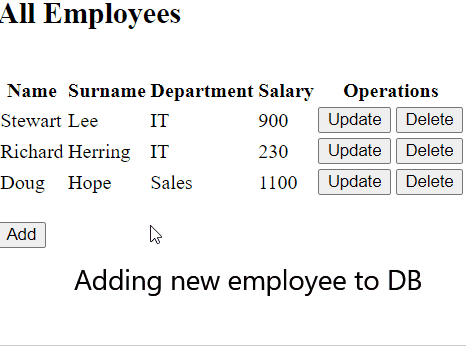

# Employees database. MVC + Hebirnate + AOP
## from Stepik Java Spring course

Created a user interface using Model–view–controller (MVC) design pattern.  
Interface is connected to MySQL database via Hibernate.  
Used Data Access Object (DAO) pattern to isolate the application/business layer from the database.  
Implemented simple logging with AOP(aspectJ).  

You can list, add/delete employees to database or change their info.  

